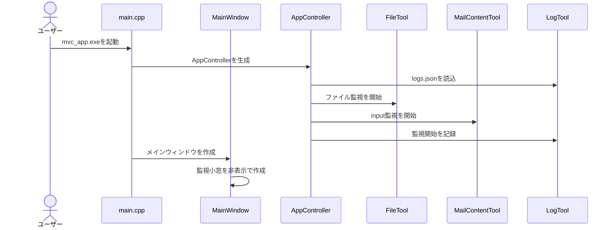
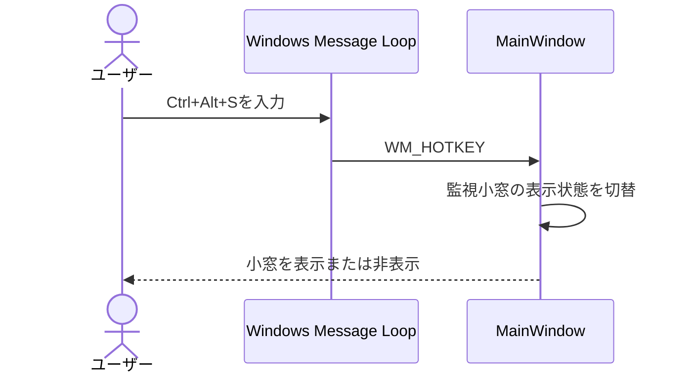
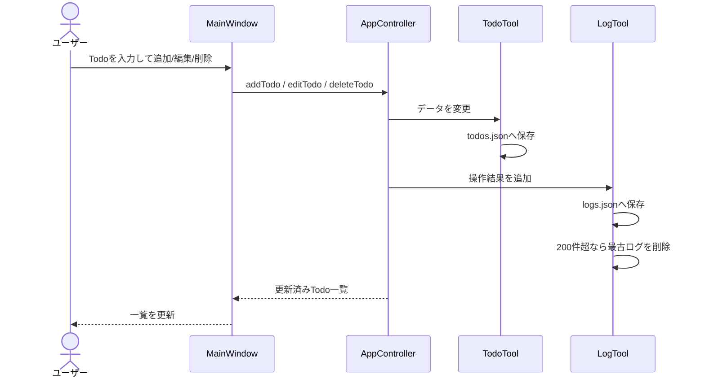
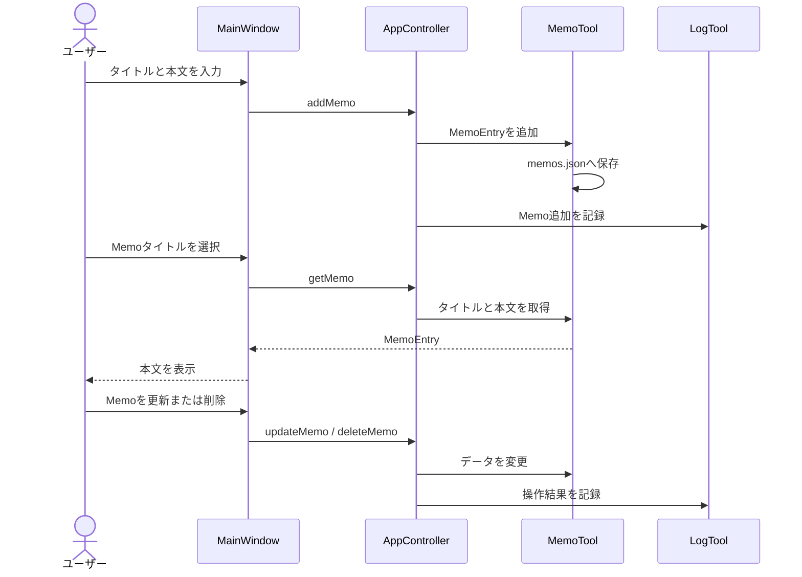
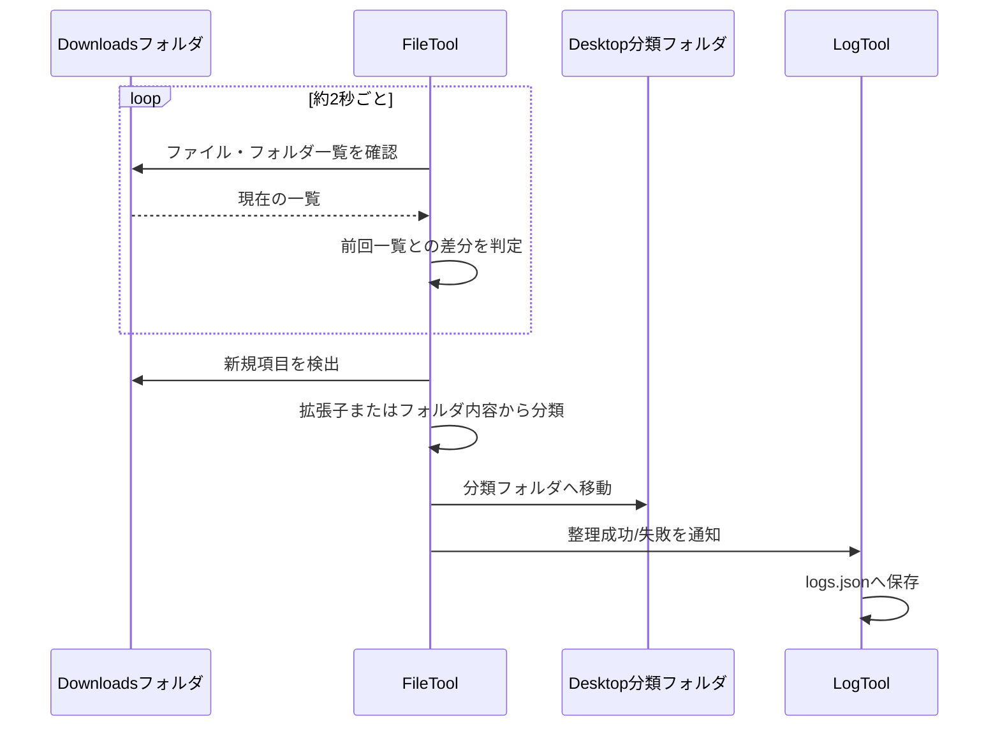
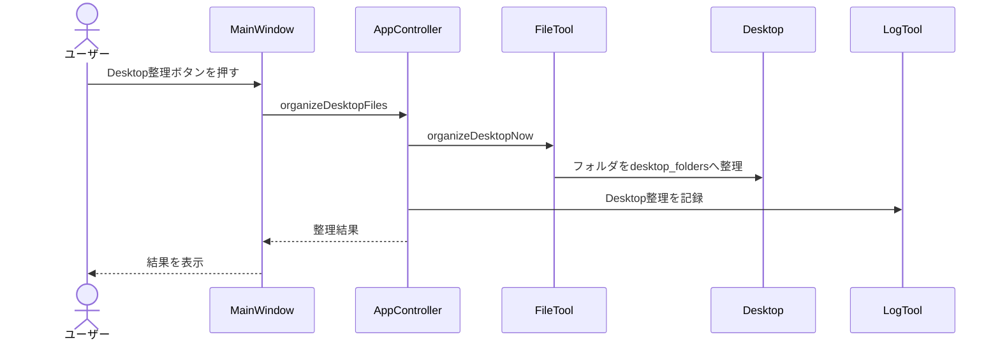
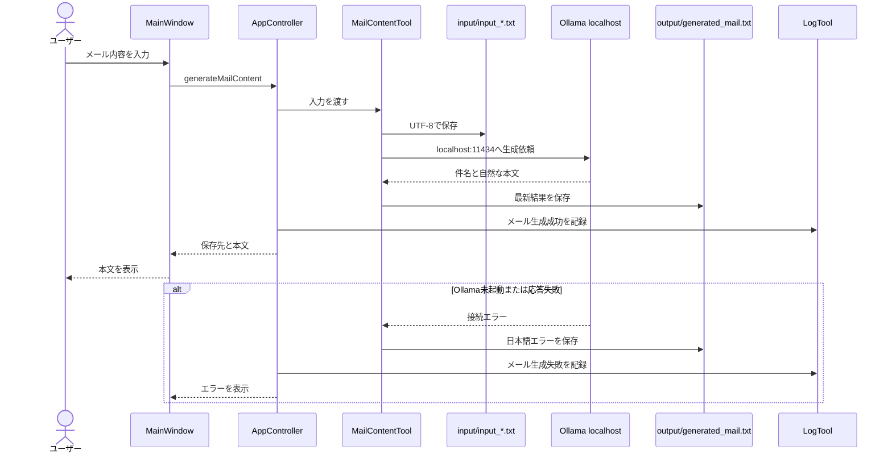
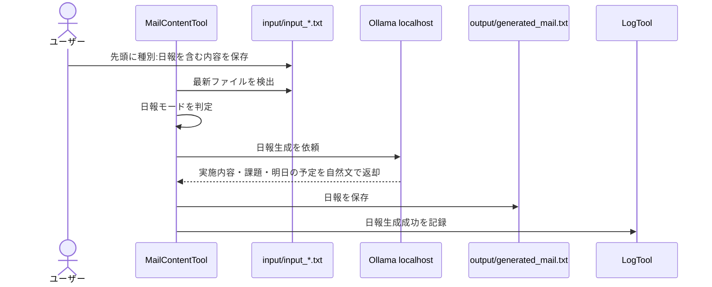
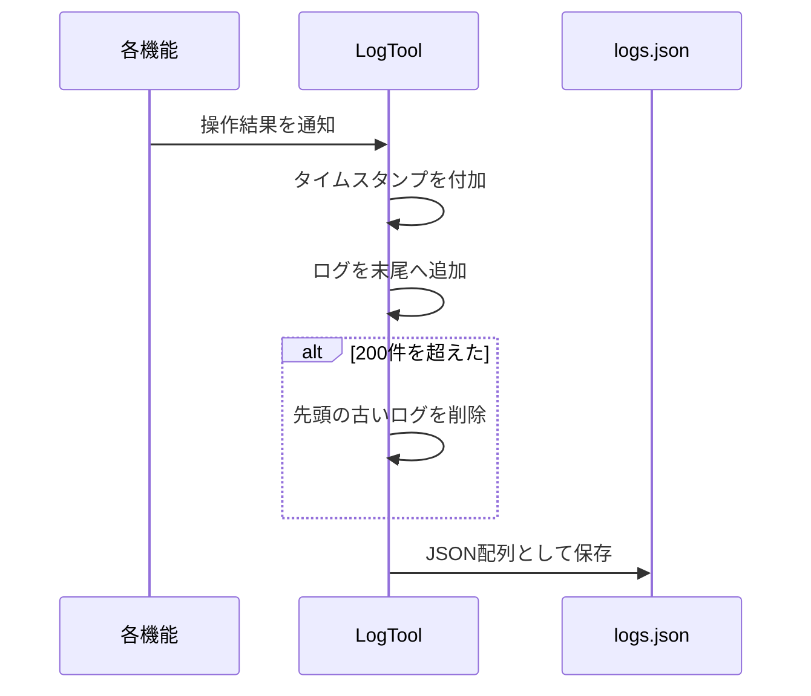

# Googleテスト用シーケンス

## 1. 起動と監視開始

## 2. Ctrl+Alt+Sで小窓を表示

## 3. Todoの追加・編集・削除

## 4. Memoの登録・選択・更新・削除

## 5. Downloads自動監視・整理

## 6. Desktop手動整理

## 7. 通常メール生成

## 8. 日報生成

## 9. ログバッファ

## 10. Googleテスト実施順

1. アプリをビルドする。
2. `logs.json` をバックアップする。
3. アプリを起動し、監視小窓が自動表示されないことを確認する。
4. `Ctrl+Alt+S` で小窓が切り替わることを確認する。
5. Todo、Memo、Logの追加・編集・削除を確認する。
6. Downloadsにテスト用ファイルとフォルダを追加し、自動整理を確認する。
7. Desktop整理をボタンから実行する。
8. 通常メールを生成する。
9. `種別:日報` を含む入力で日報を生成する。
10. Ollama停止時にエラー処理とログ記録を確認する。
11. `logs.json` が200件を超えないことを確認する。
12. テスト終了後、テスト用の入力・出力ファイルを手動で削除する。
