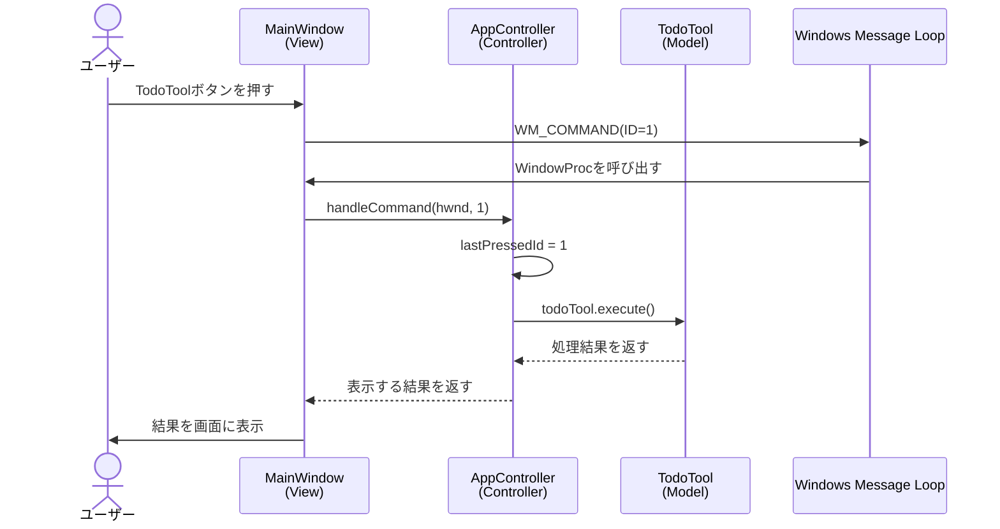
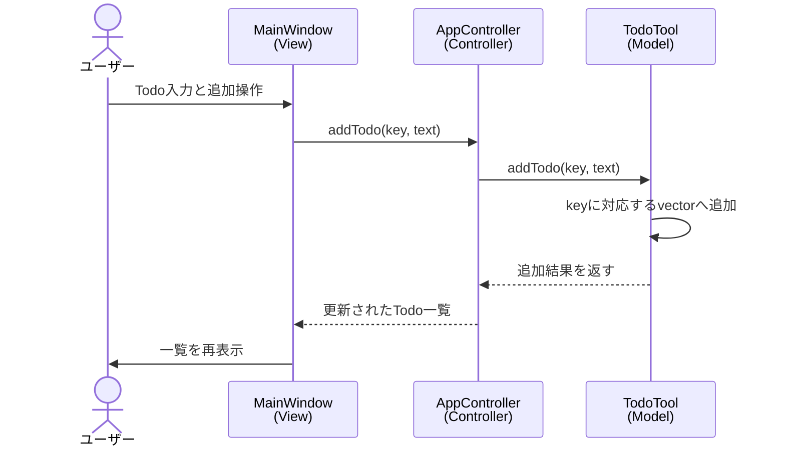

# MVCシーケンス

このプロジェクトでは、画面操作をView、処理の振り分けをController、データと業務処理をModelが担当します。

## ボタン押下の基本シーケンス



## Todo追加のシーケンス



## 責務の境界

| 層 | 担当 | 担当しないこと |
|---|---|---|
| View | ウィンドウ、ボタン、入力、表示 | Todoデータの直接操作、業務ルール |
| Controller | IDの判定、Model呼び出し、画面更新の指示 | Windows APIの細かな画面構築、データの直接管理 |
| Model | `key -> vector` のデータ管理、Todo処理 | ボタンID、MessageBox、ウィンドウハンドル |

## 理想的な呼び出し関係

```text
User
  ↓
View: MainWindow
  ↓  commandId / user input
Controller: AppController
  ↓  model method
Model: TodoTool / MemoTool / LogTool / FileTool
  ↓  result
Controller
  ↓  view update data
View
  ↓
User
```

## 現在のコードからの改善ポイント

1. `MainWindow` は `todoTool.execute()` を直接呼ばず、必ず `AppController` に渡す。
2. `AppController` は `HWND` をModelへ渡さない。
3. `TodoTool` は `MessageBoxW` を呼ばず、処理結果だけを返す。
4. `lastPressedId` はControllerが保持し、ViewやModelにグローバル変数を置かない。
5. Modelのデータ型は必要に応じてControllerへ直接公開せず、検索結果や処理結果として返す。
